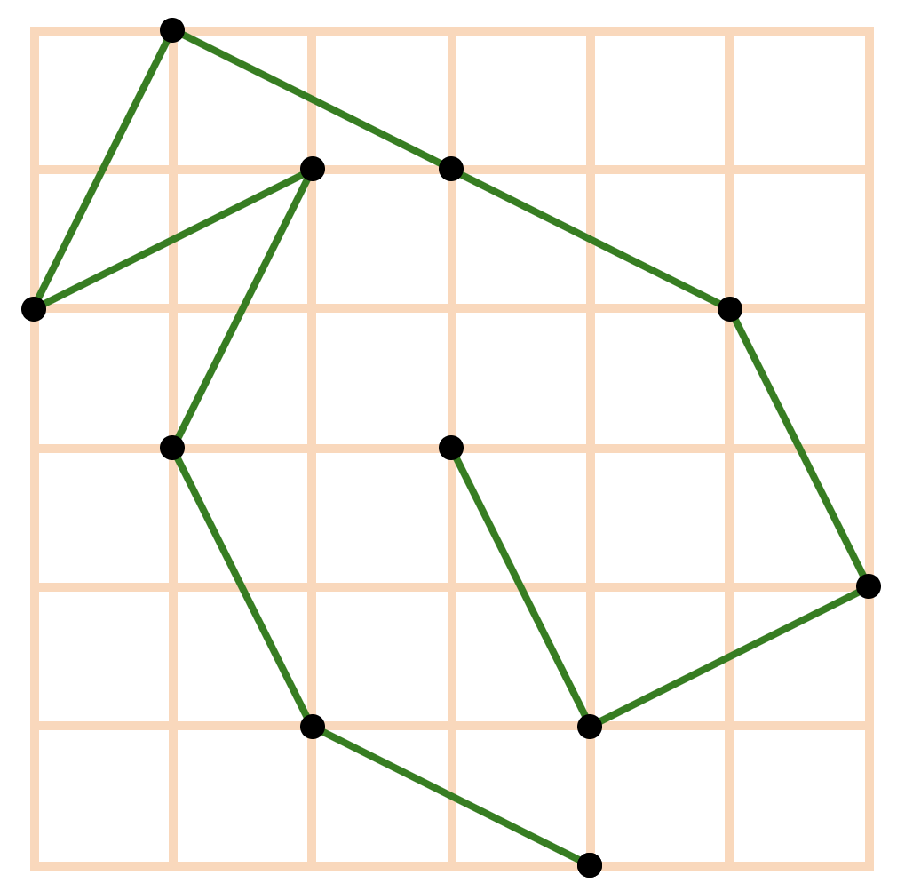

# geom-puzzle

Find the longest non-self-intersecting broken line between two points. Each segment must correspond to a knight move.

To run the application, execute the `run.py` script. The server will be running on port `8016`.
